<head>
    <link rel = "stylesheet" type = "text/css" href = "izumeme.css">
    
</head>
<body>
<!--carousel-->
 <!-- Slideshow container -->
 

    <!-- Full images with numbers and message Info -->
    

      
    

  
    

        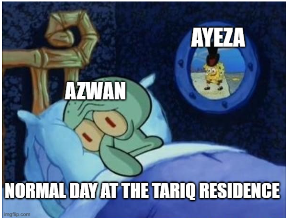
      

    

      
    

    

        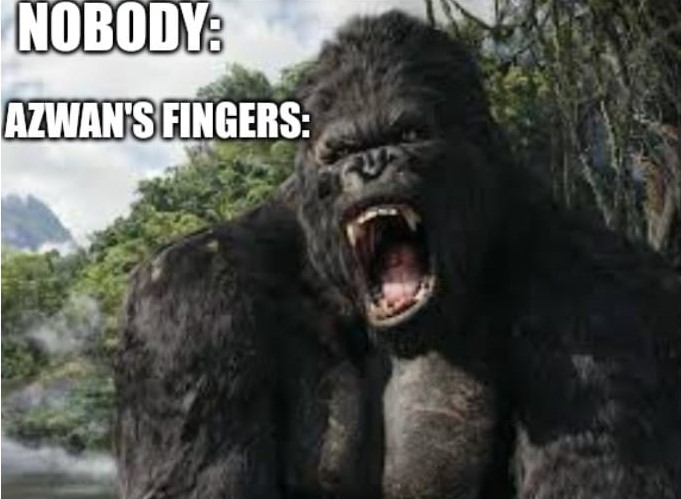
      

      

        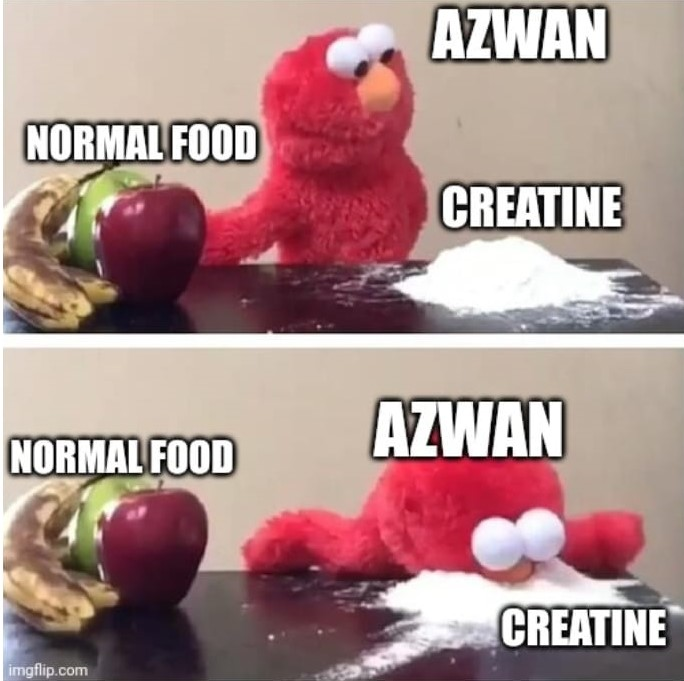
      

    

        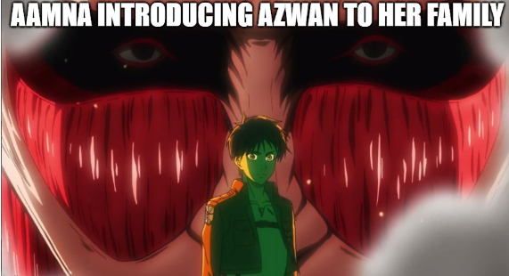
    

    

        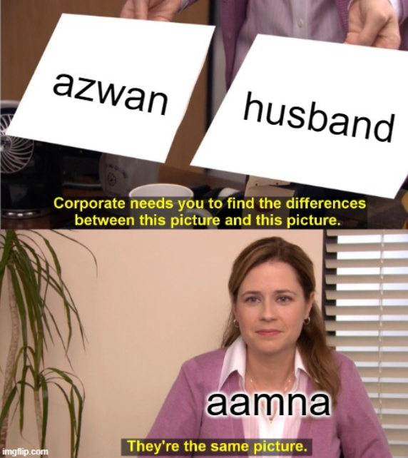
    

    

        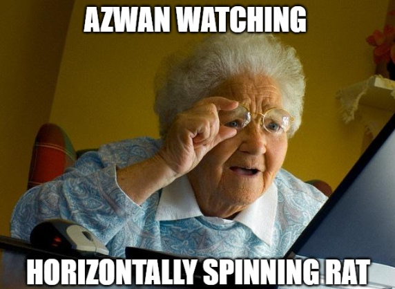
      

      

        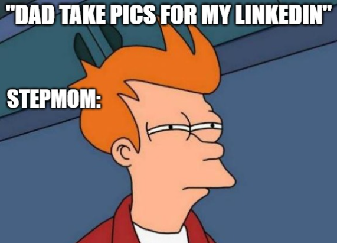
      

      

        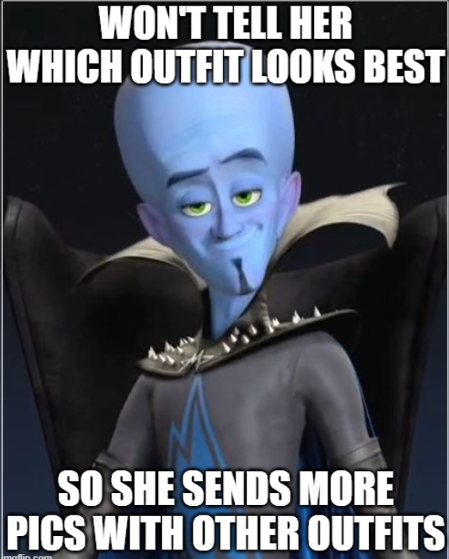
      

      

        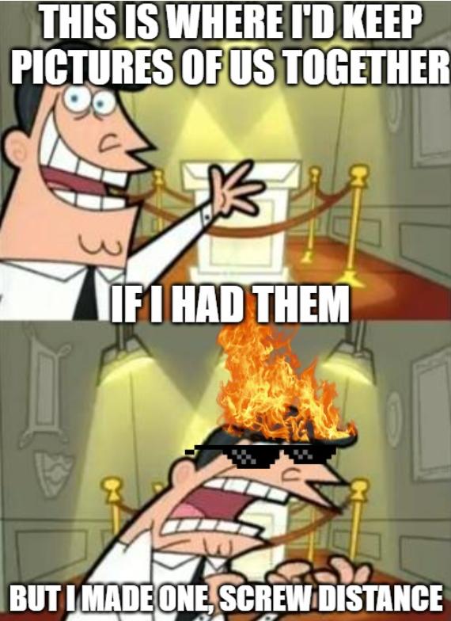
      

      

        
      

      

        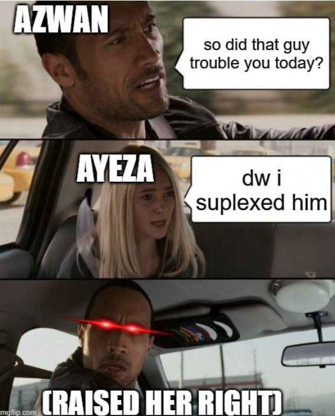
      

      

        
      

      

        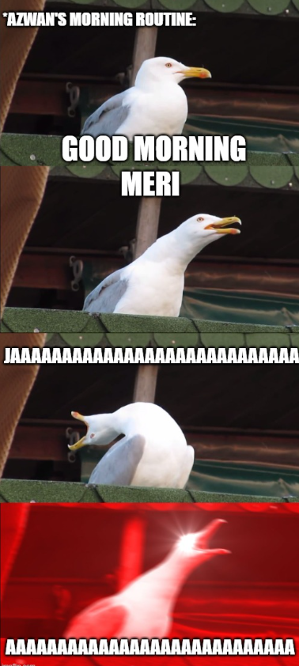
      

  
    <!-- Back and forward buttons -->
    <a class="Back" onclick="plusSlides(-1)">&#10094;</a>
    <a class="forward" onclick="plusSlides(1)">&#10095;</a>
  

   
  
  <!-- The circles/dots -->
  

    
    
    
  
 
  </body>

